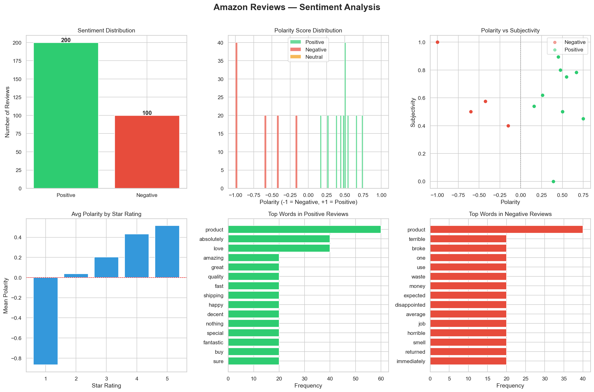

# 🛒 Amazon Reviews Sentiment Analysis

### CodeAlpha Data Analytics Internship – Task 4

This project performs sentiment analysis on Amazon product reviews using Natural Language Processing (NLP) techniques. The analysis classifies customer reviews into Positive, Neutral, and Negative sentiments and visualizes the results through an interactive dashboard.


## 📌 Project Overview

Customer reviews provide valuable insights into product quality and customer satisfaction. This project analyzes Amazon product reviews using TextBlob sentiment analysis to understand customer opinions, identify sentiment patterns, and extract meaningful insights from textual data.

The project combines text preprocessing, sentiment classification, word frequency analysis, and data visualization.


## 🎯 Objectives

* Analyze customer sentiment from Amazon reviews.
* Classify reviews into Positive, Neutral, and Negative categories.
* Calculate sentiment polarity and subjectivity scores.
* Study the relationship between ratings and sentiment.
* Identify commonly used positive and negative words.
* Generate visual insights through dashboard visualizations.
* Demonstrate practical applications of NLP in customer feedback analysis.


## 📊 Dataset Information

The dataset contains Amazon product reviews and rating information.

### Features Used

| Feature | Description |
|----------|-------------|
| Review Text | Customer review content |
| Rating/Score | Product rating provided by customer |
| Polarity | Sentiment polarity score (-1 to +1) |
| Subjectivity | Subjectivity score (0 to 1) |
| Sentiment | Positive, Neutral, or Negative |


## 📈 Analysis Performed

* Text Cleaning and Preprocessing
* Stopword Removal
* Sentiment Classification
* Polarity Analysis
* Subjectivity Analysis
* Star Rating Analysis
* Positive Word Frequency Analysis
* Negative Word Frequency Analysis
* Dashboard Visualization


## 📊 Dashboard Visualizations

The generated dashboard (`sentiment_analysis.png`) includes:

| Visualization | Purpose |
|--------------|---------|
| Sentiment Distribution | Analyze review sentiment proportions |
| Polarity Score Distribution | Study sentiment intensity |
| Polarity vs Subjectivity | Explore review characteristics |
| Average Polarity by Star Rating | Analyze rating-sentiment relationship |
| Top Words in Positive Reviews | Identify positive feedback trends |
| Top Words in Negative Reviews | Identify common customer complaints |


## 🔑 Key Findings

### 😊 Sentiment Distribution

* Positive reviews dominated the dataset.
* Most customers expressed favorable opinions about products.
* Negative reviews represented a smaller portion of overall feedback.

### ⭐ Rating vs Sentiment

* Higher ratings corresponded with higher sentiment polarity.
* Lower ratings showed stronger negative sentiment.
* Customer ratings closely aligned with sentiment scores.

### 👍 Positive Feedback Trends

Frequently occurring positive words included:

* product
* amazing
* love
* great
* quality
* happy
* fantastic

These words indicate customer satisfaction with product quality and usability.

### 👎 Negative Feedback Trends

Frequently occurring negative words included:

* terrible
* broke
* waste
* disappointed
* horrible
* returned
* refund

Negative reviews mainly focused on poor quality and unmet expectations.

### 📊 Polarity & Subjectivity

* Positive reviews generally showed higher polarity scores.
* Negative reviews exhibited strong negative polarity.
* Most reviews were moderately subjective, reflecting personal experiences.


## 🛠 Technologies Used

* Python
* Pandas
* NumPy
* Matplotlib
* Seaborn
* TextBlob
* NLTK
* Regular Expressions (Regex)


## ⚙️ Installation

### Install Required Libraries

```bash
pip install pandas numpy matplotlib seaborn textblob nltk
```


## ▶️ How to Run

Execute the script:

```bash
python sentiment_analysis.py
```

The script will automatically:

1. Load Amazon review data.
2. Clean and preprocess review text.
3. Perform sentiment analysis.
4. Generate visualizations.
5. Create the dashboard.
6. Save the output image as `sentiment_analysis.png`.


## 📁 Project Structure

```text
Amazon_Reviews_Sentiment_Analysis/
│
├── sentiment_analysis.py
├── sentiment_analysis.png
└── README.md
```


## 🖼 Output

<h2>🛒 Amazon Reviews Sentiment Dashboard</h2>

<p align="center">
  
</p>


## 🚀 Future Enhancements

* Implement machine learning-based sentiment classification.
* Use advanced NLP models such as BERT.
* Perform aspect-based sentiment analysis.
* Create interactive dashboards using Plotly.
* Deploy the project as a web application.


## 👨‍💻 Author

**Penugonda Susmitha**

Bachelor of Technology (Computer Science and Engineering)  

Sri Venkateswara College of Engineering

GitHub: https://github.com/Susmitha35-git


## 🙏 Acknowledgements

* CodeAlpha
* Amazon Review Dataset Contributors
* NLTK
* TextBlob
* Python Open Source Community
* Data Science Community


## 📄 License

This project is intended for educational and internship purposes.

---

⭐ If you found this project useful, consider giving it a star.
